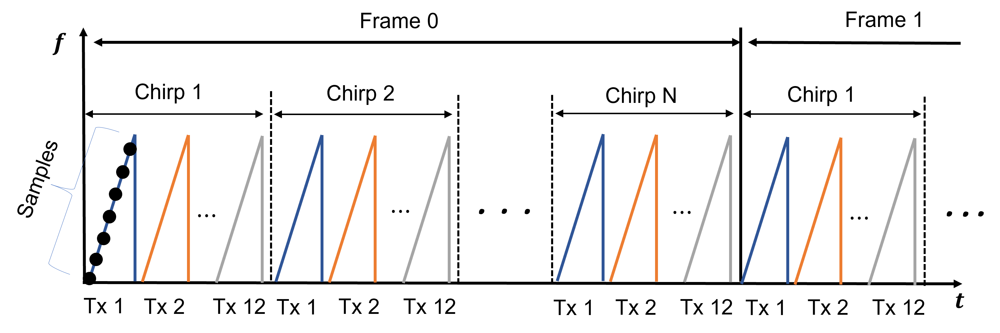

# Raw Radar ADC Dataset for Carry Object Detection

A dataset for the 2D-MIMO MMWave Radar with the raw ADC data being recorded. Three main objects carried by individual - phones, laptops, knives - were collected to fit the carry object detection scenario. 

<p align="center">  </p>

## Citations

> [**Learning to Detect Open Carry and Concealed Object With 77 GHz Radar**](https://ieeexplore.ieee.org/abstract/document/9765320),            
> Xiangyu Gao, Hui Liu, Sumit Roy, Guanbin Xing, Ali Alansari, and Youchen Luo, <br/>
> *arXiv technical report* ([arXiv 2111.00551](https://arxiv.org/abs/2111.00551.pdf))  
    
    @ARTICLE{9765320,  author={Gao, Xiangyu and Liu, Hui and Roy, Sumit and Xing, Guanbin and Alansari, 
        Ali and Luo, Youchen},  journal={IEEE Journal of Selected Topics in Signal Processing},   
        title={Learning to Detect Open Carry and Concealed Object With 77 GHz Radar},   
        year={2022},  volume={16},  number={4},  pages={791-803},  doi={10.1109/JSTSP.2022.3171168}}

> [**RAW ADC DATA OF 2D-MIMO MMWAVE RADAR FOR CARRY OBJECT DETECTION**](https://ieee-dataport.org/documents/raw-adc-data-2d-mimo-mmwave-radar-carry-object-detection),            
> Xiangyu Gao, Sumit Roy, Hui Liu, Youchen Luo, Guanbin Xing, <br/>
> *IEEE Dataport*

    @data{begn-ye78-22, doi = {10.21227/begn-ye78}, url = {https://dx.doi.org/10.21227/begn-ye78},
        author = {Gao, Xiangyu and Roy, Sumit and Liu, Hui and Luo, Youchen and Xing, Guanbin},
        publisher = {IEEE Dataport},
        title = {Raw ADC Data of 2D-MIMO MMWave radar for Carry Object Detection},
        year = {2022} }

## Update
***(Dec. 11, 2022) Initial release of dataset and tools.***

## Contact
Any questions or suggestions are welcome! 

Xiangyu Gao [xygao@uw.edu](mailto:xygao@uw.edu) 

## Introduction
In this dataset, we provided the raw *analog-to-digital-converter* (ADC) data of a 77GHz mmwave radar for the carry object detection scenario. The overall dataset contains approximately **3000 frames** of *radar data* as well as the synchronized *camera images* and *labels*. For each radar frame, its raw data has 4 dimension: samples (fast time), chirps (slow time), transmitters, receivers. The experiment radar was assembled from the *TI cascaded-chip TIDEP-01012* board, with *12 transmit* antennas and *16 receive* antennas. , it can form a large *2D-MIMO virtual array with 192 elements*, resulting in fine azimuth resolution (1.35°) and additional elevation resolution (19°). Other parameter configurations of radar were described in detail below. 

The data collection was done in the building lobby and laboratory room with the focus of capturing the data for *three main objects carried by individual: phones, laptops, knives (include metallic butter knives and cutting knives)*. Each object can either be **openly carried** or be **concealed**. A single data collection run consisted of a subject holding one of the three objects listed above, and walking at a normal pace on a random path for 10 seconds in front of the testbed. To add variability to the data, the walking pattern of subjects was always randomize and the location of where the objects were concealed or how the objects were openly carried was always changed. 

## Download

Download dataset from the google drive link:
```
https://drive.google.com/file/d/1IcrY3Hm-o9fxUwlZ-j2rLgLuAn0XQSKl/view?usp=share_link
``` 
Or from IEEE Dataport:
```
https://ieee-dataport.org/documents/raw-adc-data-2d-mimo-mmwave-radar-carry-object-detection
```

## Dataset Structure and Format

The dataset consists of multiple sequences, e.g., "2021_05_11_bk_cc000", "2021_05_11_bk_cc001". Under each sequence folder, there exists the image folder *"images_0"*, and radar data folder *"radar_raw_frame"*, and label file *"labels.txt"*.

The overall dataset structure is presented as below.

    Carry Object
    ---2021_05_11_bk_cc000
       ---images_0
       ---radar_raw_frame
       ---labels.txt
    ---2021_05_11_bk_cc001
       ......
       
The "radar_raw_frame" folder contains raw ADC radar data in **.mat* format, and "images_0" folder contains camera images in **.jpg* format, and labels in **.txt* format. The detailed data format is explained below.

### Radar ADC Data

*  For each radar frame, its raw data (*.mat) has *4 dimension: samples (256), chirps (61), receivers (16), transmitters (12)*. All transmitters were arranged with *time-division multiplexing* (TDM), i.e., send chirp signal one by one.

    The example frame structure is shown as below:
<p align="center">  </p>

* The placement of transmitters and received were plotted in the left figure below, from the [TI documentation](https://www.ti.com/lit/ug/tiduen5a/tiduen5a.pdf). Through TDM, the formed MIMO array is 2D with maximum horizontal aperture being 42.5λ and maximum vertical aperture being 3λ, where λ is the wavelength.  
    The 2D MIMO array is shown in the right figure below:
<p align="center">  </p>

* All radar configurations are included in [config](config.py).

### Camera Image

*  The camera image for each frame is with 1440x1080 pixels.

### Labels

*  Each row of "labels.txt" contains one label in format *[frame_id, uid, px, py, wid, len, class]*, where *frame_id* is the index of frame, *uid* is the unique tracking id of individual in this sequence, *px, py, wid, len* are the x center, y center, width, and length of the bounding box for individual/pedestrian; *class* is the class id of carried object, with the id number represents below.

        'laptop': 5,
        'phone': 1,
        'knife': 2,
        'butter_knife': 2,
        'key': 4,

## Dataset Tools

### Software Requirement and Installation

Python 3.6 (please refer to [INSTALL](requirements.txt) to set up libraries.)

Under prepare...

## License

This tool is release under MIT license (see [LICENSE](LICENSE)).

## Acknowledgement
This project was supported by the [FUNLAB](https://depts.washington.edu/funlab/), [University of Washington](http://www.washington.edu/). This project is not possible without multiple great opensourced codebases. We list some notable examples below.

* [microDoppler](https://github.com/Xiangyu-Gao/mmWave-radar-signal-processing-and-microDoppler-classification)
* [ramp-cnn](https://github.com/Xiangyu-Gao/Radar-multiple-perspective-object-detection)
