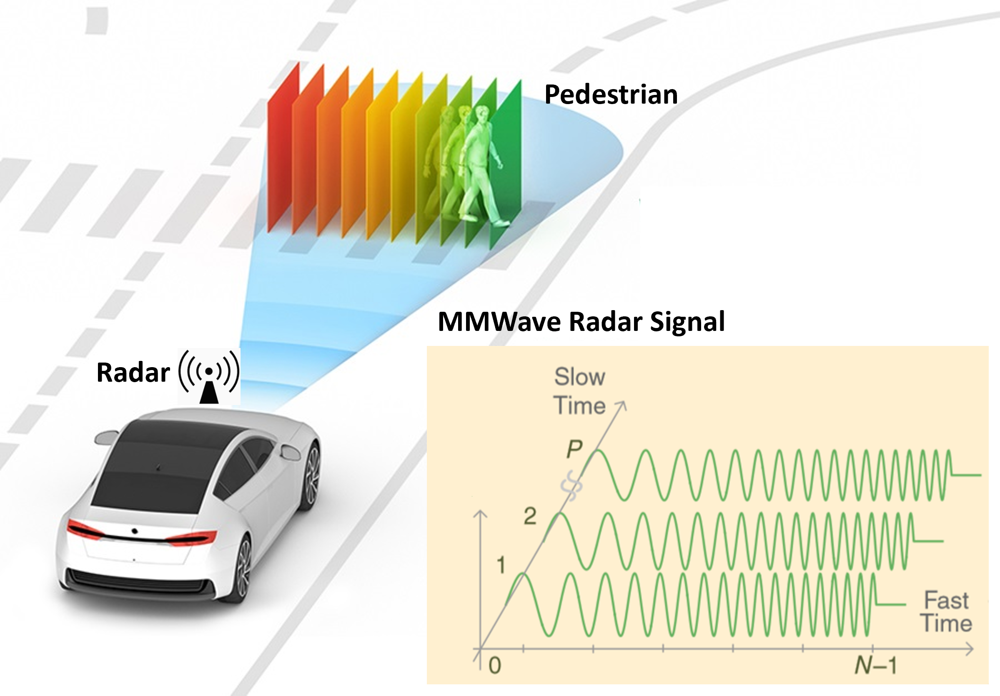
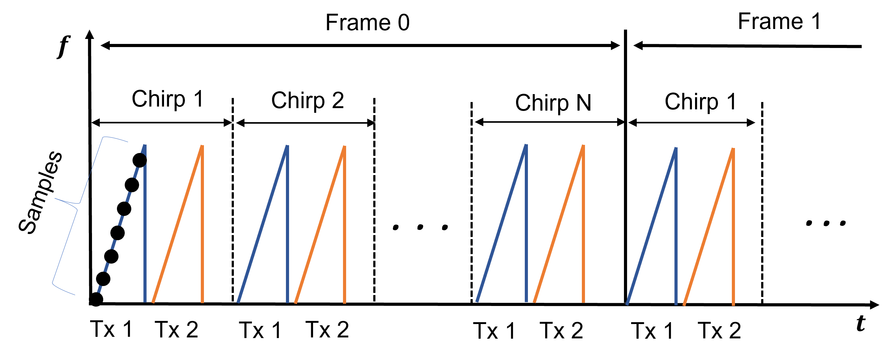
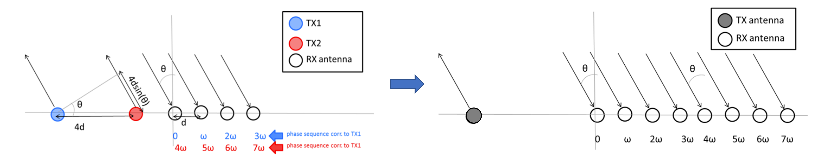

# Raw Radar ADC Dataset for Automotive Object Detection

A dataset for the 2TX-4RX MMWave Radar with the raw ADC data being recorded. Three main objects - pedestrians, cyclists, cars - were collected to fit the automotive object detection scenario. 

<p align="center">  </p>

## Citations

> [**RAMP-CNN: A Novel Neural Network for Enhanced Automotive Radar Object Recognition**](https://arxiv.org/pdf/2011.08981.pdf),            
> Xiangyu Gao, Guanbin Xing, Sumit Roy, and Hui Liu, <br/>
> *arXiv technical report* ([arXiv 2011.08981](https://arxiv.org/abs/2011.08981))  

    @ARTICLE{9249018,  author={Gao, Xiangyu and Xing, Guanbin and Roy, Sumit and Liu, Hui},  
        journal={IEEE Sensors Journal},   
        title={RAMP-CNN: A Novel Neural Network for Enhanced Automotive Radar Object Recognition},   
        year={2021},  volume={21},  number={4},  pages={5119-5132},  doi={10.1109/JSEN.2020.3036047}}

> [**Raw ADC Data of 77GHz MMWave radar for Automotive Object Detection**](https://ieee-dataport.org/documents/raw-adc-data-77ghz-mmwave-radar-automotive-object-detection),            
> Xiangyu Gao, Youchen Luo, Guanbin Xing, Sumit Roy, Hui Liu, <br/>
> *IEEE Dataport*

    @data{xm40-jx59-22, doi = {10.21227/xm40-jx59}, url = {https://dx.doi.org/10.21227/xm40-jx59},
        author = {Gao, Xiangyu and Luo, Youchen and Xing, Guanbin and Roy, Sumit and Liu, Hui},
        publisher = {IEEE Dataport},
        title = {Raw ADC Data of 77GHz MMWave radar for Automotive Object Detection},
        year = {2022} }
    
    

## Update
***(Dec. 11, 2022) Initial release of dataset and tools.***

## Contact
Any questions or suggestions are welcome! 

Xiangyu Gao [xygao@uw.edu](mailto:xygao@uw.edu) 

## Introduction
In this dataset, we provided the raw *analog-to-digital-converter* (ADC) data of a *77GHz mmwave* radar for the automotive object detection scenario. The overall dataset contains approximately **19800** frames of radar data as well as synchronized camera images and labels. For each radar frame, its raw data has *4 dimension: samples (fast time), chirps (slow time), transmitters, receivers*. The experiment radar was assembled from the *TI AWR 1843* board, with 2 horizontal transmit antennas and 4 receive antennas. With *time-division multiplexing* on all transmitters, it can form a 1D-MIMO virtual array with 8 elements. 

The data collection was done on the *campus, road, and parking lot* during the daytime, with the focus of capturing the data for *three main objects: pedestrians, cyclists, and cars*. The collected objects can be either *moving (mostly)* or *static*. A single data collection run consisted of multiple objects listed above moving or being static at a normal speed for 30 seconds in front of the testbed. More information in terms of dataset structure, format, tools, and radar configuration was described in README documentation.

## Download

Download dataset from the google drive link:
```
https
``` 
Or from IEEE Dataport:
```
https://ieee-dataport.org/documents/raw-adc-data-77ghz-mmwave-radar-automotive-object-detection
```

## Dataset Structure and Format

The dataset consists of multiple sequences, e.g., "2021_05_11_bk_cc000", "2021_05_11_bk_cc001". Under each sequence folder, there exists the image folder *"images_0"*, and radar data folder *"radar_raw_frame"*, and label file *"labels.txt"*.

The overall dataset structure is presented as below.

    Automotive
    ---2019_04_09_bms1000
       ---images_0
       ---radar_raw_frame
       ---labels.txt
    ---2019_04_09_cms1000
       ......
       
The "radar_raw_frame" folder contains raw ADC radar data in **.mat* format, and "images_0" folder contains camera images in **.jpg* format, and labels in **.txt* format. The detailed data format is explained below.

### Radar ADC Data

*  For each radar frame, its raw data (*.mat) has *4 dimension: samples (128), chirps (255), receivers (4), transmitters (2)*. All transmitters were arranged with *time-division multiplexing* (TDM), i.e., send chirp signal one by one.

    The example frame structure is shown as below:
<p align="center">  </p>

* The placement of 2 transmitters and 4 receivers were plotted in the left figure below, from the [TI documentation](https://www.ti.com/lit/an/swra554a/swra554a.pdf). Through TDM, the it forms a 1 by 8 MIMO array as shown in the right figure below:
<p align="center">  </p>

* All radar configurations are included in [config](config.py).

### Camera Image

*  The camera image for each frame is with 1440x1080 pixels.

### Labels

*  Each row of "labels.txt" contains one label in format *[frame_id, uid, px, py, wid, len, class]*, where *frame_id* is the index of frame, *uid* is the unique tracking id of individual in this sequence, *px, py, wid, len* are the x center, y center, width, and length of the bounding box for individual/pedestrian; *class* is the class id of carried object, with the id number represents below.

        'laptop': 5,
        'phone': 1,
        'knife': 2,
        'butter_knife': 2,
        'key': 4,

## Dataset Tools

### Software Requirement and Installation

Python 3.6 (please refer to [INSTALL](requirements.txt) to set up libraries.)

Under prepare...

## License

This tool is release under MIT license (see [LICENSE](LICENSE)).

## Acknowledgement
This project was supported by the [FUNLAB](https://depts.washington.edu/funlab/), [University of Washington](http://www.washington.edu/), and [Silkwave Holdings](https://silkwave.com.hk/). This project is not possible without multiple great opensourced codebases. We list some notable examples below.

* [microDoppler](https://github.com/Xiangyu-Gao/mmWave-radar-signal-processing-and-microDoppler-classification)
* [ramp-cnn](https://github.com/Xiangyu-Gao/Radar-multiple-perspective-object-detection)
